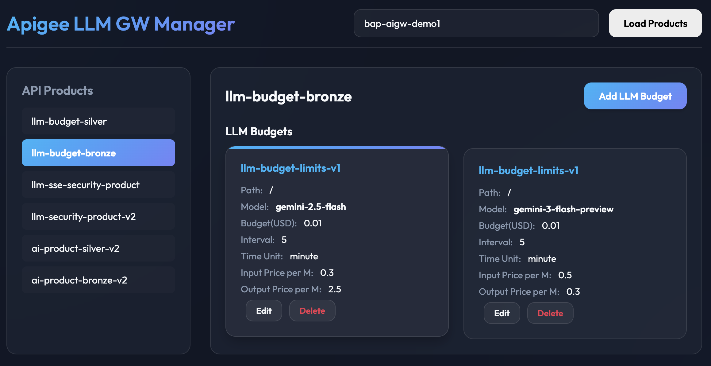
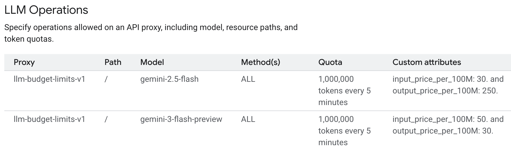
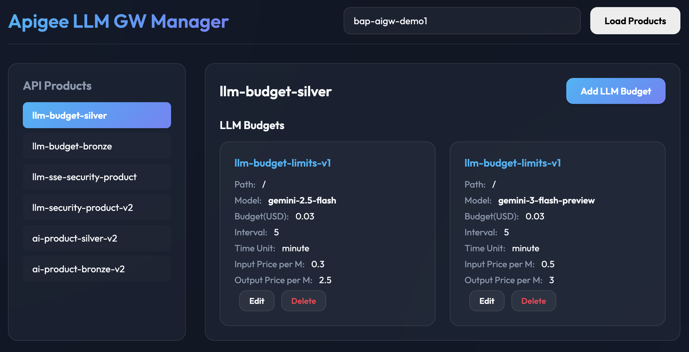
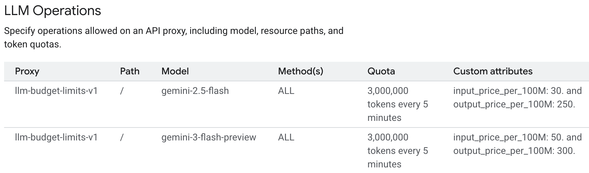

# Apigee LLM Budget & Quota Management

This project provides a solution for managing budget and quota for LLM (Large Language Model) API calls using Apigee X.

Compared to the reference [apigee-samples/llm-token-limits-v2](https://github.com/GoogleCloudPlatform/apigee-samples/tree/main/llm-token-limits-v2), this project has the following key differences:

## Key Differences (Compared to Reference)

1.  **Cost-Based Quota Management**: Instead of just limiting the number of tokens, it manages quota based on the **calculated cost (USD)** by setting unit prices for input/output tokens per model.
2.  **Dynamic Pricing and Budget Configuration**: You can input and manage budget and token unit prices for each LLM Operation in the API Product via a Web UI.
3.  **Apigee Proxy Integration**: When an API is called, it extracts the LLM Operation information registered in the API Product, calculates the actual cost in real-time by combining it with the token usage from the LLM response, and deducts it from the quota.

---

## Project Structure

-   `apiproxy/`: Apigee API Proxy bundle
    -   Enforces quota based on cost using `LLMTokenQuota` policies (`LTQ-TokenEnforce` and `LTQ-TokenCount`).
    -   `retrievePricingInfo.js`: Reads pricing information from the API Product and calculates the total cost by multiplying it with the response token count.
-   `budget-ui/`: Web UI for managing LLM Operations and budgets (Python Flask)
    -   Calls Apigee APIs to manage `llmOperationGroup` in API Products.
-   `notebook/`: Jupyter notebook for testing
    -   `llm_budget_limits_v1.ipynb`: Test notebook designed to be run in Colab Enterprise.

---

## Architecture and Workflow

### 1. Configuration via UI (`llm-budget-ui`)
-   Users select an API Product in the UI and enter the following information for each model:
    -   **Budget**: Budget to allocate (in USD)
    -   **Interval**: Quota renewal interval
    -   **Time Unit**: Quota renewal time unit (minute, hour, day, etc.)
    -   **Input Price per M**: Input price per 1 Million tokens (in USD)
    -   **Output Price per M**: Output price per 1 Million tokens (in USD)
-   This information is stored in `operationConfigs` within `llmOperationGroup` of the API Product.
    -   The budget is stored as an integer multiplied by `100,000,000` in `llmTokenQuota.limit`. (i.e., $1 = 100,000,000 units)
    -   Unit prices are stored in `attributes` as `input_price_per_100M` and `output_price_per_100M`, multiplied by `100`. (e.g., entering $1.5 stores 150)

-   The following screen shows budget settings by model in API Product.


-   And these budgets and unit prices are displayed in llmOperations as follows.



### 2. API Proxy Behavior (`llm-budget-limits-v1`)
-   **On Request**:
    -   `VA-VerifyAPIKey` verifies the client's API Key and retrieves the `llmOperationGroup` JSON data set in the API Product.
    -   `LTQ-TokenEnforce` policy checks if the current accumulated cost exceeds the budget.
-   **On Response**:
    -   `AM-ExtractTokenCount`: Reads `promptTokenCount`, `candidatesTokenCount`, and `thoughtsTokenCount` from the Gemini response's `usageMetadata`.
    -   In `retrievePricingInfo.js`:
        1.  Finds the `operationConfig` matching the called model and extracts the unit prices.
        2.  Calculates total cost: `(promptTokens * inputPrice) + ((candidatesTokens + thoughtsTokens) * outputPrice)`.
        3.  The calculated cost is saved in the `token_price_per_100M` variable.
    -   `LTQ-TokenCount` policy updates the quota counter using the value of `token_price_per_100M`.


---

## Installation and Deployment

### 1. Clone the Repository

1.  Open **Cloud Shell** in the Google Cloud Console.
2.  Clone this repository and navigate to the project directory:
    ```bash
    git clone https://github.com/cbhong-ops/llm-budget-limits-v1.git
    cd llm-budget-limits-v1
    ```
### 2. Environment Setup

1.  Set up Application Default Credentials (ADC) in Cloud Shell. This is required because the deployment scripts use `apigeecli` with the `--default-token` flag:
    ```bash
    gcloud auth application-default login
    ```
2.  Configure the `env.sh` file in the project root directory with your specific values:

    -   `PROJECT_ID`: Your Google Cloud Project ID
    -   `APIGEE_ENV`: Apigee environment name

3.  After configuring the variables, run the following command to apply them to your current shell session:
    ```bash
    source ./env.sh
    ```


### 3. API Proxy, API Product, Developer and Client App Setup
1.  Ensure `env.sh` is configured correctly.
2.  Run the deployment script from the root directory: `./deploy-llm-budget-limits-v1.sh`
    *   This script uses `apigeecli` to bundle and deploy the proxy.
    *   It also creates API Products (`llm-budget-bronze`, `llm-budget-silver`), a Developer, and a Client App subscribed to these products.
    *   It outputs the API keys for the products.
    *   It requires `jq` to be installed.
    *   It will automatically attempt to install `apigeecli` if it is not found in the path.

### 4. UI Deployment and Configuration (Cloud Run)
1.  Ensure `env.sh` is configured correctly.
2.  Run the deployment script from the root directory: `./deploy-ui.sh`
    *   This script creates a service account `llm-budget-limits-v1-svc-acct` with required roles if it doesn't exist.
    *   It deploys the `llm-budget-ui` service to Cloud Run using this service account.
    *   It applies `--ingress all`.
    *   **Note**: If prompted `Allow unauthenticated invocations to [llm-budget-ui] (y/N)?`, answer `N` (unauthenticated access is not recommended for this management UI).

3.  After successful deployment, the Cloud Run Service URL will be displayed in the terminal output.
4.  In the Google Cloud Console, go to the **Cloud Run Services** menu, select the `llm-budget-ui` service, navigate to the **Security** tab, enable **Identity-Aware Proxy (IAP)**, and add authorized users to the policy.
    *   **Note**: It may take a few minutes for the IAP configuration to take effect after enabling it. Please wait a moment before accessing the UI.

5.  Access the UI by opening the provided Cloud Run Service URL in your browser.

6.  On the UI screen:
    *   Enter your **Apigee Org** name.
    *   Select the **API Product** you want to configure (e.g., `llm-budget-bronze` or `llm-budget-silver`).
    *   Set the **Budget** and **Unit Costs** (Input/Output prices) for each required Model.
    *   **Note**: You can refer to the [Gemini Models Pricing Page](https://cloud.google.com/gemini-enterprise-agent-platform/generative-ai/pricing) for the unit costs of Gemini models.


### Configuration Examples

#### Example 1: llm-budget-bronze
When you select `llm-budget-bronze` and set the values in the UI:


These settings are reflected in the `llmOperations` of the **llm-budget-bronze** API Product:


#### Example 2: llm-budget-silver
Similarly, for `llm-budget-silver`, you can configure it in the UI:


And it will be reflected in the **llm-budget-silver** API Product:



---

## Testing with Colab Enterprise

You can use the provided Jupyter notebook to test the Apigee LLM Budget & Quota Management system. The notebook is located at `notebook/llm_budget_limits_v1.ipynb`.

### Prerequisites
- A Google Cloud Project with Vertex AI and Colab Enterprise enabled.
- An Apigee API Proxy deployed and an API Key generated for a product that includes the proxy.

### Steps to run in Colab Enterprise

1.  **Access Colab Enterprise**:
    - Go to the Google Cloud Console.
    - Search for "Vertex AI" and navigate to the Vertex AI dashboard.
    - In the left navigation menu, click on **Colab Enterprise**.

2.  **Import the Notebook**:
    - Download the file `notebook/llm_budget_limits_v1.ipynb` from Cloud Shell to your local machine.
    - In the Colab Enterprise UI, click on the **Import notebooks** icon in the **Quick Actions** section.
    - Select the notebook file you just downloaded to import it.
    - **Connect to a Runtime**: Click the **Connect** button at the top right of the notebook to connect to a runtime.
    - Run the first cell to install the `google-genai` SDK. (If an error occurs, you can ignore it and proceed.)


3.  **Configure Variables**:
    - In the second code cell, update the following variables with your specific values:
        - `PROJECT_ID`: Your Google Cloud Project ID.
        - `API_ENDPOINT`: The URL of your Apigee API Proxy (e.g., `https://your-apigee-hostname/v1/samples/llm-budget-limits`).
            - **Note**: You can find your Apigee hostname (`your-apigee-hostname`) in the **Management > Environments > Environment Groups** section of the Apigee Console.

        - `API_KEY`: The API Key associated with the product that grants access to the proxy.
        - `MODEL`: The model you want to test with (defaults to `gemini-2.5-flash`).
            - **Note**: You must use the model that you have configured in the Web UI. In the sample setup, `gemini-2.5-flash` and `gemini-3-flash-preview` were used.


4.  **Run the Notebook**:
    - Run the initialization cell with your updated variables.
    - Run the subsequent cells to execute the test scenarios. The notebook will send requests to the Apigee proxy, which will enforce the cost-based quota.

---

## Clean Up

To delete all resources created by this sample and avoid incurring charges:

1.  Ensure `env.sh` is configured correctly.
2.  Run the undeployment script from the root directory: `./undeploy-llm-budget-limits-v1.sh`
    *   This script deletes the Developer App, Developer, API Products (`llm-budget-bronze`, `llm-budget-silver`), and undeploys and deletes the API Proxy.
    *   It also deletes the Cloud Run service `llm-budget-ui` and the associated service account `llm-budget-quota-svc-acct`.
