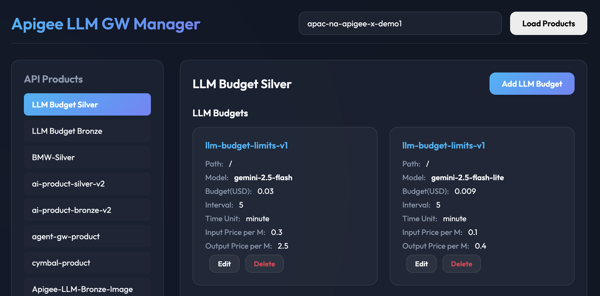

# Apigee LLM Budget & Quota Management

This project provides a solution for managing budget and quota for LLM (Large Language Model) API calls using Apigee X.

Compared to the reference [apigee-samples/llm-token-limits-v2](https://github.com/GoogleCloudPlatform/apigee-samples/tree/main/llm-token-limits-v2), this project has the following key differences:

## Key Differences (Compared to Reference)

1.  **Cost-Based Quota Management**: Instead of just limiting the number of tokens, it manages quota based on the **calculated cost (USD)** by setting unit prices for input/output tokens per model.
2.  **Dynamic Pricing and Budget Configuration**: You can input and manage budget and token unit prices for each LLM Operation in the API Product via a Web UI.
3.  **Apigee Proxy Integration**: When an API is called, it extracts the LLM Operation information registered in the API Product, calculates the actual cost in real-time by combining it with the token usage from the LLM response, and deducts it from the quota.

---

## Project Structure

-   `apiproxy/`: Apigee API Proxy bundle
    -   Enforces quota based on cost using `LLMTokenQuota` policies (`LTQ-TokenEnforce` and `LTQ-TokenCount`).
    -   `retrievePricingInfo.js`: Reads pricing information from the API Product and calculates the total cost by multiplying it with the response token count.
-   `budget-ui/`: Web UI for managing LLM Operations and budgets (Python Flask)
    -   Calls Apigee APIs to manage `llmOperationGroup` in API Products.

---

## Architecture and Workflow

### 1. Configuration via UI (`budget-ui`)
-   Users select an API Product in the UI and enter the following information for each model:
    -   **Budget**: Budget to allocate (in USD)
    -   **Interval**: Quota renewal interval
    -   **Time Unit**: Quota renewal time unit (minute, hour, day, etc.)
    -   **Input Price per M**: Input price per 1 Million tokens (in USD)
    -   **Output Price per M**: Output price per 1 Million tokens (in USD)
-   This information is stored in `operationConfigs` within `llmOperationGroup` of the API Product.
    -   The budget is stored as an integer multiplied by `100,000,000` in `llmTokenQuota.limit`. (i.e., $1 = 100,000,000 units)
    -   Unit prices are stored in `attributes` as `input_price_per_100M` and `output_price_per_100M`, multiplied by `100`. (e.g., entering $1.5 stores 150)

-   The following screen shows budget settings by model in API Product.

### 2. API Proxy Behavior (`apiproxy`)
-   **On Request**:
    -   `VA-VerifyAPIKey` verifies the client's API Key and retrieves the `llmOperationGroup` JSON data set in the API Product.
    -   `LTQ-TokenEnforce` policy checks if the current accumulated cost exceeds the budget.
-   **On Response**:
    -   In `retrievePricingInfo.js`:
        1.  Finds the `operationConfig` matching the called model and extracts the unit prices.
        2.  Reads `promptTokenCount`, `candidatesTokenCount`, and `thoughtsTokenCount` from the Gemini response's `usageMetadata`.
        3.  Calculates total cost: `(promptTokens * inputPrice) + ((candidatesTokens + thoughtsTokens) * outputPrice)`.
        4.  The calculated cost is saved in the `token_price_per_100M` variable.
    -   `LTQ-TokenCount` policy updates the quota counter using the value of `token_price_per_100M`.

---

## Installation and Deployment

### Environment Setup
Configure the `env.sh` file in the root directory with your specific values:
-   `PROJECT_ID`: Your Google Cloud Project ID
-   `UI_SERVICE_ACCOUNT`: Service account for Cloud Run
-   `APIGEE_ENV`: Apigee environment name

### UI Deployment (Cloud Run)
1.  Ensure `env.sh` is configured correctly.
2.  Run the deployment script from the root directory: `./deploy_ui.sh`
    *   This script deploys the `llm-budget-ui` service to Cloud Run.
    *   It applies `--ingress all` and removes `--allow-unauthenticated`.
3.  After successful deployment, the Cloud Run Service URL will be displayed in the terminal output.
4.  Access the UI by opening the provided URL in your browser.

### API Proxy Deployment
1.  Ensure `env.sh` is configured correctly.
2.  Run the deployment script from the root directory: `./deploy_proxy.sh`
    *   This script uses `apigeecli` to bundle and deploy the proxy.
    *   It requires `jq` to be installed.
    *   It will automatically attempt to install `apigeecli` if it is not found in the path.

---

## Testing with Colab Enterprise

You can use the provided Jupyter notebook to test the Apigee LLM Budget & Quota Management system. The notebook is located at `notebook/llm_budget_limits_v1.ipynb`.

### Prerequisites
- A Google Cloud Project with Vertex AI and Colab Enterprise enabled.
- An Apigee API Proxy deployed and an API Key generated for a product that includes the proxy.

### Steps to run in Colab Enterprise

1.  **Access Colab Enterprise**:
    - Go to the Google Cloud Console.
    - Search for "Vertex AI" and navigate to the Vertex AI dashboard.
    - In the left navigation menu, click on **Colab Enterprise**.

2.  **Upload the Notebook**:
    - Click on **Upload notebook** and select the file `notebook/llm_budget_limits_v1.ipynb` from this repository.

3.  **Configure Variables**:
    - Open the uploaded notebook.
    - In the second code cell, update the following variables with your specific values:
        - `PROJECT_ID`: Your Google Cloud Project ID.
        - `LOCATION`: The region where your resources are deployed (e.g., `us-central1`).
        - `API_ENDPOINT`: The URL of your Apigee API Proxy (e.g., `https://your-apigee-hostname/v1/samples/llm-budget-limits`).
        - `API_KEY`: The API Key associated with the product that grants access to the proxy.
        - `MODEL`: The model you want to test with (defaults to `gemini-2.5-flash-lite`).

4.  **Run the Notebook**:
    - Run the first cell to install the `google-genai` SDK.
    - Run the initialization cell with your updated variables.
    - Run the subsequent cells to execute the test scenarios. The notebook will send requests to the Apigee proxy, which will enforce the cost-based quota.
